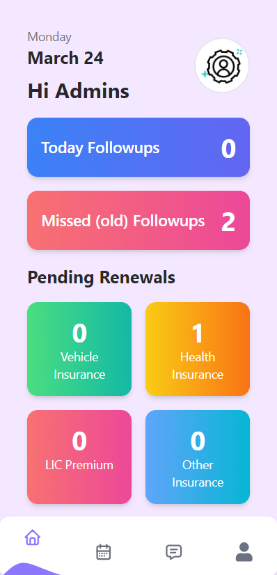
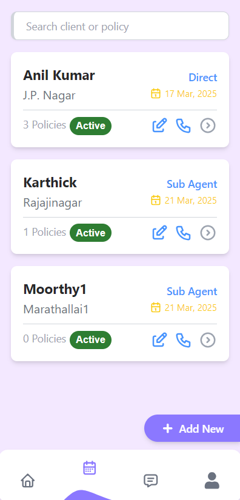

# 🚀 Insurance CRM

## 📌 Project Overview

**Insurance CRM** is a feature-rich web application designed to streamline policy management, client handling, and policy renewal processes. Built using **React (Vite)**, **Tailwind CSS**, and **Material-UI**, this CRM ensures an efficient and seamless user experience.

## 🎯 Features

- 🔹 **Client Management** – Add, update, and manage client details.
- 🔹 **Policy Handling** – Create and maintain policy records.
- 🔹 **Renewals & Reminders** – Automated policy renewal tracking.
- 🔹 **Authentication System** – Secure login and password reset.
- 🔹 **User-Friendly UI** – Powered by **MUI & Tailwind CSS**.
- 🔹 **API Integration** – Efficient data handling with **Axios**.
- 🔹 **Encryption & Security** – Implemented using **Crypto-JS**.
- 🔹 **Real-time Notifications** – Toast alerts with **React Toastify & Sonner**.

## 🏗️ Tech Stack

### 🔧 Frontend

- **React (Vite) 18**
- **Tailwind CSS**
- **Material UI (MUI)**
- **Formik & Yup** (Form validation)
- **Axios** (API calls)
- **Moment.js** (Date handling)

## 📂 Directory Structure

```
ag-solutions-bangalore-insurance-crm/
├── README.md
├── index.html
├── package.json
├── tailwind.config.js
├── vite.config.js
├── src/
│   ├── components/
│   │   ├── Layout.jsx
│   │   ├── Navbar.jsx
│   │   ├── Sidebar.jsx
│   │   ├── common/
│   │   │   ├── ButtonConfig.jsx
│   │   │   ├── InputField.jsx
│   │   │   ├── LoaderComponent.jsx
│   ├── config/
│   ├── pages/
│   │   ├── Client/
│   │   ├── Policy/
│   │   ├── Renewal/
│   │   ├── auth/
│   │   ├── home/
│   │   └── api/
│   ├── assets/
│   ├── App.jsx
│   ├── main.jsx
│   └── index.css
```

## 🔨 Installation & Setup

Follow these steps to set up and run the project locally:

### 📥 Clone the Repository

```bash
git clone https://github.com/AG-Solutions-Bangalore/insurance-crm
cd insurance-crm
```

### 📦 Install Dependencies

```bash
npm install
```

### 🚀 Start the Development Server

```bash
npm run dev
```

### 🏗️ Build for Production

```bash
npm run build
```

## 📸 Screenshots

### 🏠 Home Page



### 👥 Client Page 👤



### 📜 Policy Page 📝


## 🤝 Contributing

Contributions are welcome! Please follow these steps:

1. Fork the repository.
2. Create a new branch (`feature/new-feature`).
3. Commit your changes (`git commit -m "Added a new feature"`).
4. Push to your branch (`git push origin feature/new-feature`).
5. Open a Pull Request.

## 🔒 License

This project is licensed under the **MIT License**.

## 📬 Contact

📩 **Need Help?** Contact us at `https://ag-solutions.in/contact.php` or open an issue on GitHub! 🚀
